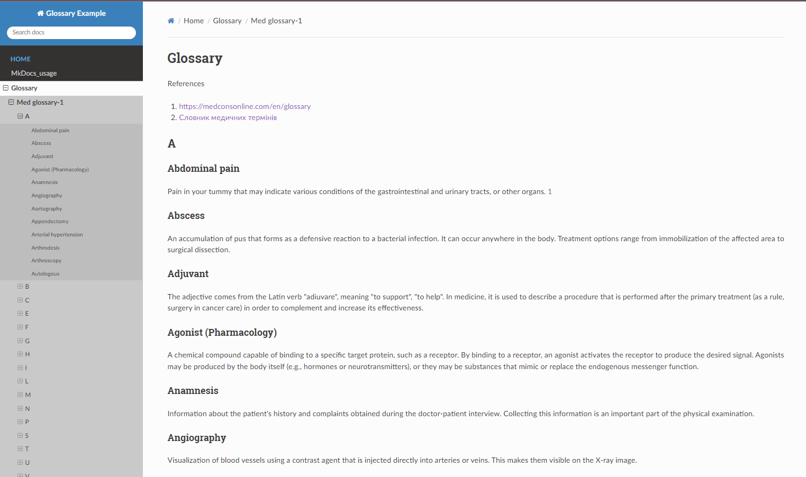
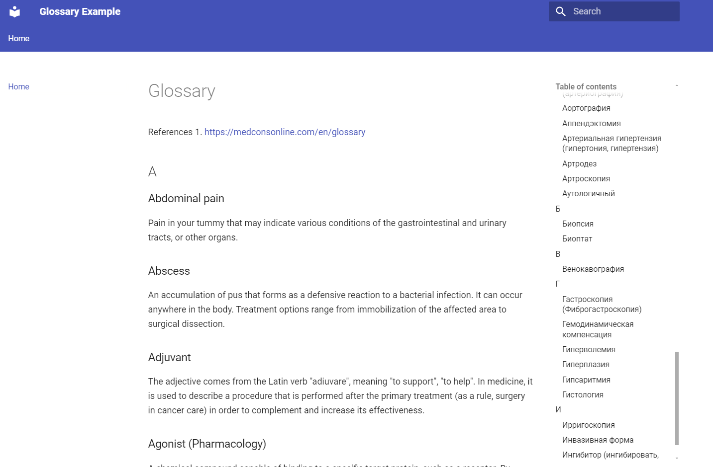

# MkDocs

Static site generator (no database required), MkDocs can generate a
simple web-based glossary from markdown files.

## Key Features:

Documentation generator, markdown support.

## How to use:

Write your glossary terms and definitions in markdown files. Generate
static HTML files with MkDocs.

``` bash
pip install mkdocs
```

------------------------------------------------------------------------

Example:

``` markdown
# Glossary
## Term 1
Definition for Term 1.
## Term 2
    Definition for Term 2.
Generate site:
```

``` bash
mkdocs build
```

More info: [MkDocs Documentation](https://www.mkdocs.org/)

## Configurations

### yml_config-1- [readthedocs]{.title-ref} theme

YML file [readthedocs]{.title-ref} theme 
``` yml 
site_name: Glossary
nav:
  - Home: index.md
  - MkDocs_usage: MkDocs_usage.md
  - Glossary:
      - Medical glossary-1: medical-glossary-1.md
      - Oncology glossary-1: oncology-glossary-1.md
theme: readthedocs
extra_css:
  - css/customWidth.css
plugins:
  - search:
      prebuild_index: true
      encoding: 'utf-8'
      lang:
        - en
        - ru
```

This configuration creates design like on the picture above



### yml_config-2 - [material]{.title-ref} theme

YML file [material]{.title-ref} theme

``` yml
site_name: Glossary Example
nav:
    - Home: med_glos_1_1.md
    - About: MkDocs_usage.rst
    - Intro: MkDocs_usage.rst
theme: material
features:
    - navigation.tabs
    - navigation.expand
    - search.highlight
    - search.share
    - navigation.search
    - user_color_mode_toggle  # Enable the color mode toggle
palette:
    - scheme: default
    - scheme: slate
    - scheme: ocean
    - scheme: sepia
include_sidebar: true
custom_dir: docs/css
extra_css:
      - css/customWidth.css
```

This configuration creates design like on the picture above



## References

1.  med_glos_1.md: <https://medconsonline.com/en/glossarij>
2.  med_glos_1_1.md -same as med_glos_1.md but formated in markdown
    style

------------------------------------------------------------------------

## Deploy project on GitHub

Guide on how to deploy MkDocs (current project) on GitHub Pages

Please, follow these steps:

### Step 1: Install MkDocs

If you haven\'t already installed MkDocs, you can do so using pip:

``` bash
pip install mkdocs
```

You can verify the installation by running:

``` bash
mkdocs --version
```

### Step 2: Create a New MkDocs Project

Run the following command to create a new MkDocs project:

``` bash
mkdocs new my_project
cd my_project
```

This will create a new directory with the basic structure of an MkDocs
project.

### Step 3: Customize Your Project

Edit the mkdocs.yml configuration file and the markdown files in the
docs/ folder to add your content.

For example, you can edit mkdocs.yml to set your site name:

``` yaml
site_name: My Documentation
```

Add or modify markdown files inside the docs/ folder to create your
documentation pages.

### Step 4: Test Locally

You can run the project locally to preview your site:

:::: important
::: title
Important
:::

Execute command from the root dir of your project.
::::

``` bash
mkdocs serve
```

Open your browser and go to <http://127.0.0.1:8000> to view the site.

### Step 5: Prepare for GitHub Deployment

You need to ensure that your project is linked to a GitHub repository.
If you haven\'t created a repository yet, do the following:

Create a new repository on GitHub (without a README file). Inside your
project folder, initialize git, add the remote repository, and push your
project:

``` bash
git init
git add .
git commit -m "Initial commit"
git remote add origin https://github.com/USERNAME/REPOSITORY_NAME.git
git branch -M main
git push -u origin main
```

### Step 6: Deploy to GitHub Pages

MkDocs has built-in support for deploying to GitHub Pages. To do this,
run:

``` bash
mkdocs gh-deploy
```

This will:

Build your documentation into a static site. Push the static files to a
gh-pages branch on GitHub, which GitHub Pages will use to serve your
site.

### Step 7: Verify the Deployment

Once you've run mkdocs gh-deploy, GitHub Pages should automatically
start serving your site. You can view it at:

``` bash
https://USERNAME.github.io/REPOSITORY_NAME/
```

Note: It may take a few minutes for GitHub Pages to update your site.

### Step 8: Customize Your GitHub Pages Settings (Optional)

If you want to deploy the site from a different branch or folder, you
can configure GitHub Pages in your repository settings:

Go to your repository on GitHub. Click on Settings \> Pages. Choose the
gh-pages branch or the directory you want to deploy. Now your MkDocs
site should be live on GitHub Pages!

Common MkDocs Configuration for GitHub Pages You can enhance your
mkdocs.yml configuration for a better experience. For example:

``` yaml
site_name: My Documentation
theme:
  name: material
nav:
  - Home: index.md
  - About: about.md
markdown_extensions:
  - toc:
      permalink: true
```

This configuration applies a Material theme and adds navigation for your
documentation.
