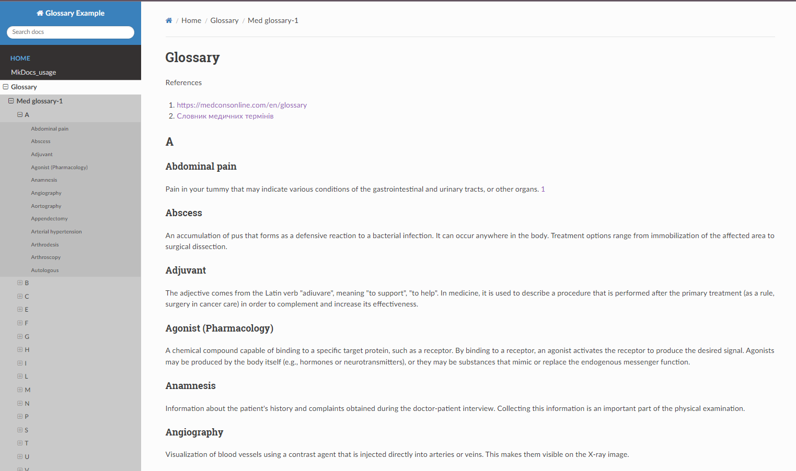
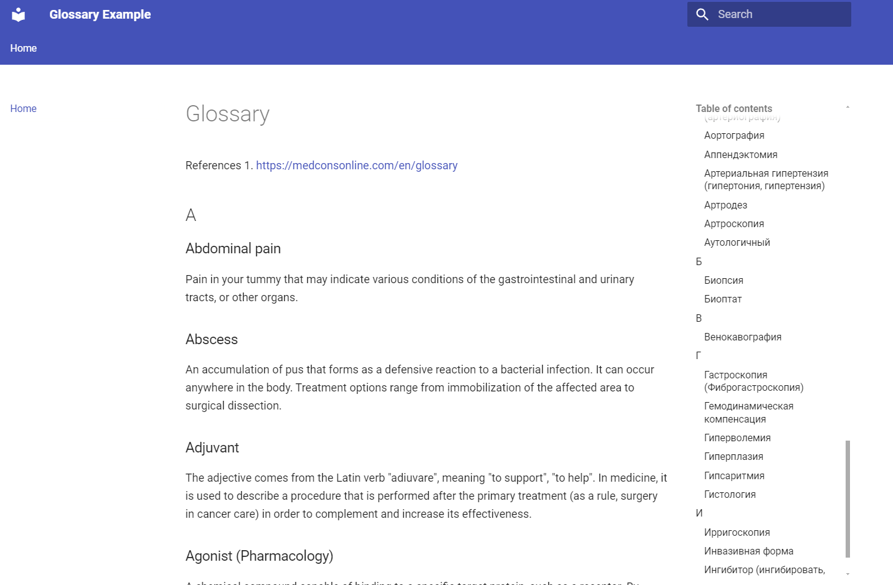

MkDocs
======

Static site generator (no database required), MkDocs can generate a simple web-based glossary from markdown files.

Key Features:
~~~~~~~~~~~~~~

Documentation generator, markdown support.

How to use:
~~~~~~~~~~~
Write your glossary terms and definitions in markdown files.
Generate static HTML files with MkDocs.

.. code-block:: bash
    pip install mkdocs

------

Example:

.. code-block:: markdown
        # Glossary
            ## Term 1
            Definition for Term 1.

        ## Term 2
            Definition for Term 2.
        Generate site:

.. code-block:: bash
        mkdocs build

More info: `MkDocs Documentation <https://www.mkdocs.org/>`_

Configurations
~~~~~~~~~~~~~~

yml_config-1- `readthedocs` theme
^^^^^^^^^^^^^^^^^^^^^^^^^^^^^^^^^^

YML file `readthedocs` theme
.. code-block::yml
    site_name: Glossary Example
    nav:
      - Home: med_glos_1_1.md
      - About: MkDocs_usage.rst
      - Intro: MkDocs_usage.rst
    theme: readthedocs
    custom_dir: docs/css
    user_color_mode_toggle: true
    extra_css:
      - css/customWidth.css

This configuration creates design like on the picture above

yml_config-2 - `material` theme
^^^^^^^^^^^^^^^^^^^^^^^^^^^^^^^

YML file `material` theme

.. code-block::yml
    site_name: Glossary Example
    nav:
      - Home: med_glos_1_1.md
      - About: MkDocs_usage.rst
      - Intro: MkDocs_usage.rst
    theme: material
      name:
      features:
        - navigation.tabs
        - navigation.expand
        - search.highlight
        - search.share
        - navigation.search
        - user_color_mode_toggle  # Enable the color mode toggle
      palette:
        - scheme: default
        - scheme: slate
        - scheme: ocean
        - scheme: sepia

    include_sidebar: true
    custom_dir: docs/css
    extra_css:
      - css/customWidth.css

This configuration creates design like on the picture above

References
~~~~~~~~~~~

#. med_glos_1.md:  `<https://medconsonline.com/en/glossarij>`_
#. med_glos_1_1.md -same as med_glos_1.md but formated in markdown style

---------

Deploy project on GitHub
~~~~~~~~~~~~~~~~~~~~~~~~~

Guide on how to deploy MkDocs (current project) on GitHub Pages

Please, follow these steps:

Step 1: Install MkDocs
^^^^^^^^^^^^^^^^^^^^^^

If you haven't already installed MkDocs, you can do so using pip:

.. code-block:: bash
    pip install mkdocs

You can verify the installation by running:

.. code-block:: bash
    mkdocs --version

Step 2: Create a New MkDocs Project
^^^^^^^^^^^^^^^^^^^^^^^^^^^^^^^^^^^^^
Run the following command to create a new MkDocs project:

.. code-block:: bash
    mkdocs new my_project
    cd my_project

This will create a new directory with the basic structure of an MkDocs project.

Step 3: Customize Your Project
^^^^^^^^^^^^^^^^^^^^^^^^^^^^^^
Edit the mkdocs.yml configuration file and the markdown files in the docs/ folder to add your content.

For example, you can edit mkdocs.yml to set your site name:

.. code-block:: yaml
    site_name: My Documentation

Add or modify markdown files inside the docs/ folder to create your documentation pages.

Step 4: Test Locally
^^^^^^^^^^^^^^^^^^^^^

You can run the project locally to preview your site:

.. important::
    Execute command from the root dir of your project.

.. code-block:: bash
    mkdocs serve

Open your browser and go to http://127.0.0.1:8000 to view the site.

Step 5: Prepare for GitHub Deployment
^^^^^^^^^^^^^^^^^^^^^^^^^^^^^^^^^^^^^^

You need to ensure that your project is linked to a GitHub repository. If you haven't created a repository yet, do the following:

Create a new repository on GitHub (without a README file).
Inside your project folder, initialize git, add the remote repository, and push your project:

.. code-block:: bash
    git init
    git add .
    git commit -m "Initial commit"
    git remote add origin https://github.com/USERNAME/REPOSITORY_NAME.git
    git branch -M main
    git push -u origin main

Step 6: Deploy to GitHub Pages
^^^^^^^^^^^^^^^^^^^^^^^^^^^^^^

MkDocs has built-in support for deploying to GitHub Pages. To do this, run:

.. code-block:: bash
    mkdocs gh-deploy

This will:

Build your documentation into a static site.
Push the static files to a gh-pages branch on GitHub, which GitHub Pages will use to serve your site.

Step 7: Verify the Deployment
^^^^^^^^^^^^^^^^^^^^^^^^^^^^^^
Once you’ve run mkdocs gh-deploy, GitHub Pages should automatically start serving your site. You can view it at:

.. code-block:: bash
    https://USERNAME.github.io/REPOSITORY_NAME/

Note: It may take a few minutes for GitHub Pages to update your site.

Step 8: Customize Your GitHub Pages Settings (Optional)
^^^^^^^^^^^^^^^^^^^^^^^^^^^^^^^^^^^^^^^^^^^^^^^^^^^^^^^^

If you want to deploy the site from a different branch or folder, you can configure GitHub Pages in your repository settings:

Go to your repository on GitHub.
Click on Settings > Pages.
Choose the gh-pages branch or the directory you want to deploy.
Now your MkDocs site should be live on GitHub Pages!

Common MkDocs Configuration for GitHub Pages
You can enhance your mkdocs.yml configuration for a better experience. For example:

.. code-block:: yaml

    site_name: My Documentation
    theme:
      name: material
    nav:
      - Home: index.md
      - About: about.md
    markdown_extensions:
      - toc:
          permalink: true

This configuration applies a Material theme and adds navigation for your documentation.